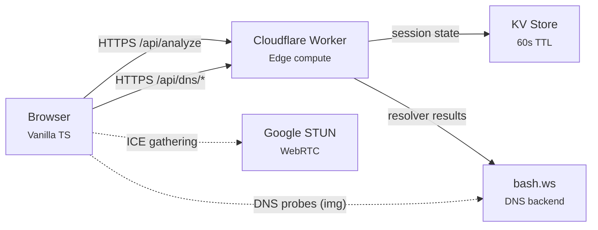

# DNS Leak Tester

**One-click network privacy scan.** Detects DNS leaks, WebRTC IP exposure, TLS fingerprint uniqueness, and browser entropy — all in about 10 seconds.

**[Try it live →](https://leak.haijieqin.com)**

---

## Why I Built This

I wanted a privacy diagnostic tool that actually practices what it preaches. Most DNS leak testers are plastered with ads, load a dozen tracking scripts, and store your data indefinitely. That defeats the whole point.

This tool runs on Cloudflare's free tier, stores nothing beyond a 60-second window, and has zero third-party scripts on the page. No cookies, no analytics, no accounts. The browser fingerprint never even leaves your machine.

It also serves as a companion to my other project, [SecureDrop](https://github.com/ygbull/SecureDrop), which focuses on application-layer security. This one covers the network layer — DNS resolution, WebRTC, TLS fingerprinting, the stuff that leaks your identity even when you think you're protected.

## How It Works

Hit the scan button and the tool runs five tests:

### DNS Leak Detection
Your browser makes DNS queries to unique subdomains. An authoritative DNS server records which resolvers actually handle the lookups. If your VPN's DNS isn't the one resolving, you've got a leak.

### WebRTC Leak Detection
WebRTC can expose your real IP even behind a VPN through ICE candidate gathering. The tool creates a data channel (no camera/mic access) and checks what IPs your browser advertises to a STUN server.

### TLS Fingerprint
Every browser has a slightly different TLS handshake — the cipher suites it offers, the extensions, the hello message length. The Cloudflare Worker reads these from the connection metadata and hashes them into a profile ID. Think of it like JA3 fingerprinting, but using the fields available on Cloudflare's free tier.

### Browser Fingerprint Entropy
Canvas rendering, WebGL renderer strings, installed fonts, audio processing quirks — your browser leaks a surprising amount of identifying information. The tool collects 18 different signals (entirely client-side) and estimates how many bits of entropy they contribute. Higher entropy = more unique = easier to track.

### IP & Geolocation
Checks your IP against known VPN and datacenter ASNs, pulls geolocation from Cloudflare's edge, and flags whether your connection looks like it's coming through a VPN or proxy.

Each test gets a pass/warn/fail verdict, and they roll up into an overall A through F grade.

## Architecture



The frontend is vanilla TypeScript bundled with Vite. No React, no Vue, no framework — just direct DOM manipulation. The backend is a single Cloudflare Worker that handles API routes and serves static assets. The whole thing runs on the free tier.

## Technical Highlights

**Zero runtime dependencies.** The `package.json` has nothing under `dependencies`. Everything — the test runner, the UI, the state machine, all of it — is vanilla TypeScript compiled to ES2022. Bundle stays under 50KB gzipped.

**Async generator test orchestration.** The scan runner is an `async function*` that yields progress updates as each test completes. The UI subscribes with `for await...of` and updates the progress bar in real time. Cancellation works through `AbortController` — one signal propagates through every fetch and timeout. If one test's backend call fails (say, the geo/IP lookup), the other tests still complete and degrade gracefully — the DNS test shows "check inconclusive" instead of claiming no leak when it can't cross-reference against your location.

**TLS fingerprinting without JA3.** Cloudflare's free tier doesn't expose JA3/JA4 hashes. Instead, the Worker reads `tlsClientCiphersSha1`, `tlsClientExtensionsSha1`, and `tlsClientHelloLength` from the connection metadata and hashes them with FNV-1a to create a profile ID. Not as granular as JA3, but enough to differentiate browser families.

**Privacy-first sharing.** Results encode into a URL fragment (`#r=base64`). Fragments aren't sent in HTTP requests by spec, so the server never sees shared results. Only grades and summaries are included — no IPs, no fingerprints, no raw data.

**Entropy estimation with correlation discount.** Each fingerprint component has a pre-computed entropy estimate (e.g., canvas: 8 bits, user agent: 10 bits). The naive sum gets multiplied by 0.7 to account for correlation between signals — screen resolution correlates with device pixel ratio, platform correlates with fonts, etc.

## Project Structure

```
src/
├── shared/hash.ts              # FNV-1a hash (shared between client + worker)
├── client/
│   ├── index.html              # Single page shell
│   ├── main.ts                 # Entry point, keyboard shortcuts
│   ├── styles/main.css         # Dark theme, self-hosted fonts
│   ├── scanner/
│   │   ├── runner.ts           # Test orchestrator (async generator) + verdict assignment
│   │   ├── dns.ts              # DNS leak probes + polling
│   │   ├── webrtc.ts           # ICE candidate analysis
│   │   ├── fingerprint.ts      # Canvas, WebGL, fonts, audio, entropy
│   │   └── types.ts
│   ├── ui/
│   │   ├── app.ts              # State machine (idle → scanning → results)
│   │   ├── report.ts           # Report card + SVG grade gauge
│   │   ├── progress.ts         # Scan progress animation
│   │   ├── grade.ts            # A-F grade computation
│   │   └── share.ts            # URL fragment encode/decode
│   └── utils/
│       ├── dom.ts              # DOM helpers, escapeHtml
│       └── format.ts           # IP formatting, abortable sleep
└── worker/
    ├── index.ts                # Router + security headers
    ├── types.ts
    ├── handlers/
    │   ├── analyze.ts          # IP/geo/TLS/ASN endpoint
    │   └── dns-proxy.ts        # DNS test start + check
    └── services/
        ├── tls-profiles.ts     # Profile hashing, colo lookup
        └── dns-backend.ts      # bash.ws API client
```

## Local Development

```bash
git clone https://github.com/ygbull/DNSLeakTester.git
cd DNSLeakTester
npm install
```

You need two terminals:

```bash
# Terminal 1: Vite dev server (serves frontend, proxies /api/* to the worker)
npm run dev

# Terminal 2: Cloudflare Worker (local)
npm run dev:worker
```

Open `http://localhost:5173`. The Vite proxy forwards API calls to wrangler on `:8787`.

Other commands:
```bash
npm run build        # Production build (frontend + worker)
npm run deploy       # Build + deploy to Cloudflare
npm run typecheck    # tsc --noEmit
npm run lint         # ESLint
npm run test         # Vitest (169 tests)
```

For deployment, copy `wrangler.toml.example` to `wrangler.toml`, fill in your KV namespace IDs and domain, and set up Cloudflare DNS.

## Limitations

**DNS leak testing uses a third-party backend.** True DNS leak detection requires your own authoritative DNS server — you need to know which resolver IP made the query, and that information only exists at the authoritative server. Cloudflare Workers sit behind Cloudflare's DNS resolver, so they can't see this. The tool proxies through [bash.ws](https://bash.ws) for now, which means bash.ws sees both your DNS resolver IP and your browsing IP via the probe requests. I'd like to self-host this eventually, but it requires infrastructure outside Cloudflare's free tier.

**No JA3/JA4 fingerprinting.** These require access to raw TLS ClientHello data, which Cloudflare only exposes on paid plans. The tool uses a hash of available TLS metadata instead — it works for broad browser differentiation but isn't as precise.

**Entropy estimates are approximate.** The per-component entropy values are based on published fingerprinting research, not a live population dataset. They're ballpark figures with a correlation discount applied. Good enough for a privacy health check, not for academic citation.

**VPN detection is heuristic.** The tool checks your ASN against a list of known VPN providers and data centers, plus keyword matching on the AS organization name. It catches most commercial VPNs but won't detect every setup.

## Privacy

This is a privacy tool, so here's exactly what happens with your data:

- **Your browser fingerprint stays in your browser.** Canvas, WebGL, fonts, audio — all collected and scored client-side. Never sent to any server.
- **Server-side data isn't stored.** Your IP, geo, and TLS metadata are read from the Cloudflare connection to generate the report, then discarded. KV entries auto-delete after 60 seconds.
- **No cookies, no analytics, no tracking.** Check the network tab if you don't believe me.
- **Third-party exposure:** The DNS test uses bash.ws (sees your resolver IP and browsing IP). The WebRTC test pings Google's STUN server (standard browser behavior).
- **Shared results are URL fragments.** Everything after `#` in a URL is never sent to the server. Only grades and summaries are encoded, not raw data.

See [docs/security-privacy.md](docs/security-privacy.md) for the full threat model and data flow.

## License

MIT
