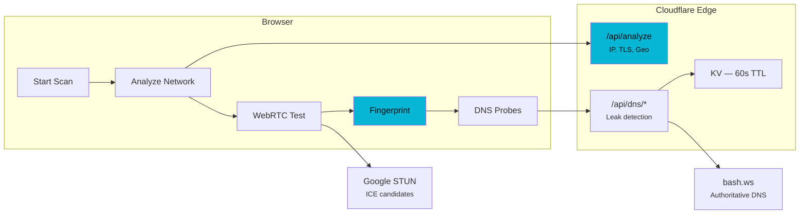

# DNS Leak Tester

[](https://github.com/ygbull/DNSLeakTester/actions/workflows/deploy.yml)
[](LICENSE)
[](https://www.typescriptlang.org/)

One-click network privacy scanner. Detects DNS leaks, WebRTC IP exposure, TLS fingerprint uniqueness, and browser entropy — all in about 10 seconds. Zero third-party scripts, zero tracking, zero storage.

**[leak.haijieqin.com](https://leak.haijieqin.com)**

## Architecture



The browser fingerprint never leaves the client. Server-side data (IP, TLS metadata) is read from the Cloudflare connection, returned in the response, and discarded — nothing is logged or stored. KV entries auto-expire after 60 seconds.

## How it works

1. You click scan. The browser hits `/api/analyze` — the Cloudflare Worker reads your IP, geolocation, ASN, and TLS handshake metadata from the connection. One request, all server-side data.
2. WebRTC test fires. A `RTCPeerConnection` gathers ICE candidates via Google's STUN server. The tool checks if your browser leaks local IPs through host candidates instead of obfuscating them with mDNS.
3. Browser fingerprint runs entirely client-side. Canvas rendering, WebGL renderer strings, installed fonts, audio processing — 18 signals scored for entropy. Never sent to any server.
4. DNS probes trigger. The browser loads 10 unique images from `*.bash.ws` subdomains, forcing DNS resolution through the full hierarchy. bash.ws's authoritative nameserver logs which resolver IPs queried it — that's how leaks are detected.
5. Everything rolls up into an A–F grade. Results can be shared via URL fragment (`#r=base64`) — the server never sees them.

## Design decisions

**Why vanilla TypeScript?** Zero runtime dependencies. No React, no Vue, no framework. The `package.json` has nothing under `dependencies`. Everything — the test runner, the UI state machine, the report card — is vanilla TypeScript compiled to ES2022. Bundle stays under 50KB gzipped.

**Why async generators?** The scan runner is an `async function*` that yields progress updates as each test completes. The UI subscribes with `for await...of` and updates in real time. Cancellation propagates through a single `AbortController` — one signal kills every in-flight fetch and timeout. If the geo lookup fails, the DNS test degrades to "inconclusive" instead of falsely reporting no leak.

**TLS fingerprinting without JA3.** Cloudflare's free tier doesn't expose JA3/JA4 hashes. Instead, the Worker reads `tlsClientCiphersSha1`, `tlsClientExtensionsSha1`, and `tlsClientHelloLength` from the connection metadata and hashes them with FNV-1a to create a composite profile ID. Not as granular as JA3, but enough to differentiate browser families.

**Why a third-party DNS backend?** True DNS leak detection requires an authoritative nameserver — you need to see which resolver IP made the query, and that information only exists at the authoritative server. Cloudflare Workers sit behind Cloudflare's DNS, so they can't see this. The tool proxies through [bash.ws](https://bash.ws) for now. Self-hosting requires a VPS outside the free tier.

**Entropy estimation with correlation discount.** Naively summing per-component entropy assumes independence between signals, which isn't true — screen resolution correlates with device pixel ratio, platform correlates with fonts. A 0.7 discount factor accounts for this, based on published fingerprinting research (Eckersley 2010, Laperdrix et al. 2016).

**$0/month.** Everything runs on Cloudflare's free tier: Workers (100K req/day), KV (1K writes/day), DNS, and static assets. No database, no VPS, no paid services.

## Features

- **Five diagnostic tests** — DNS leak, WebRTC leak, TLS fingerprint, browser entropy, IP/geo analysis
- **A–F grading** — overall privacy score based on all test verdicts
- **Zero tracking** — no cookies, no analytics, no accounts, no third-party scripts on the page
- **Zero storage** — KV entries auto-delete after 60 seconds, fingerprint never leaves the browser
- **Shareable results** — encoded in URL fragment (`#`), never sent to the server
- **Keyboard shortcuts** — `Enter` to scan, `s` to share, `r` to rescan, `Esc` to cancel, `?` for help
- **Cancel mid-scan** — `AbortController` propagates through every fetch and timeout
- **$0/month** — runs entirely on Cloudflare's free tier

## Tech stack

| Layer | Tech |
|---|---|
| Frontend | Vanilla TypeScript, Vite, CSS (no framework) |
| Backend | Cloudflare Workers |
| Storage | Cloudflare KV (60s TTL, ephemeral only) |
| DNS | Cloudflare DNS + bash.ws (authoritative backend) |
| WebRTC | Google STUN (`stun.l.google.com:19302`) |
| TLS analysis | Cloudflare `request.cf` metadata |

## Security

The tool practices what it preaches:

- **CSP** — `script-src 'self'`, `style-src 'self'`, no inline scripts, no external scripts
- **HSTS** — `Strict-Transport-Security: max-age=31536000; includeSubDomains`
- **No framing** — `X-Frame-Options: DENY`, `frame-src 'none'`
- **No referrer leaking** — `Referrer-Policy: no-referrer`
- **XSS prevention** — all dynamic content rendered via `textContent`, shared results validated against strict allowlists
- **CORS** — locked to the production origin, no wildcard fallback
- **Input validation** — test IDs validated against UUID regex, bash.ws IDs against alphanumeric regex

See [docs/security-privacy.md](docs/security-privacy.md) for the full threat model, data flow, and compliance notes.

## Self-hosting

You'll need a free Cloudflare account.

### 1. Create the KV namespace

```bash
npx wrangler kv namespace create LEAK_STORE
```

### 2. Configure the Worker

```bash
cp wrangler.toml.example wrangler.toml
```

Edit `wrangler.toml` with your KV namespace ID, domain, and zone name.

### 3. Deploy

```bash
npm install
npm run deploy
```

Then point your domain at the Worker via a CNAME record in Cloudflare DNS.

## Local development

```bash
git clone https://github.com/ygbull/DNSLeakTester.git
cd DNSLeakTester
npm install
```

You need two terminals:

```bash
# Terminal 1 — Vite dev server (proxies /api/* to the Worker)
npm run dev

# Terminal 2 — Cloudflare Worker (local)
npm run dev:worker
```

Open `http://localhost:5173`.

## Tests

```bash
npm test              # 169 tests across 16 files
npm run typecheck     # tsc --noEmit
npm run lint          # ESLint
```

## Project structure

```
src/
├── shared/hash.ts              # FNV-1a hash (shared between client + worker)
├── client/
│   ├── index.html              # Single page shell
│   ├── main.ts                 # Entry point, keyboard shortcuts
│   ├── styles/main.css         # Dark theme, self-hosted fonts
│   ├── scanner/
│   │   ├── runner.ts           # Test orchestrator (async generator)
│   │   ├── dns.ts              # DNS leak probes + polling
│   │   ├── webrtc.ts           # ICE candidate analysis
│   │   ├── fingerprint.ts      # Canvas, WebGL, fonts, audio, entropy
│   │   └── types.ts
│   ├── ui/
│   │   ├── app.ts              # State machine (idle → scanning → results)
│   │   ├── report.ts           # Report card + SVG grade gauge
│   │   ├── progress.ts         # Scan progress animation
│   │   ├── grade.ts            # A-F grade computation
│   │   └── share.ts            # URL fragment encode/decode
│   └── utils/
│       ├── dom.ts              # DOM helpers, escapeHtml
│       └── format.ts           # Formatting, abortable sleep
└── worker/
    ├── index.ts                # Router + security headers
    ├── types.ts
    ├── handlers/
    │   ├── analyze.ts          # IP/geo/TLS/ASN endpoint
    │   └── dns-proxy.ts        # DNS test start + check
    └── services/
        ├── tls-profiles.ts     # Profile hashing, colo lookup
        └── dns-backend.ts      # bash.ws API client
```

## License

MIT
